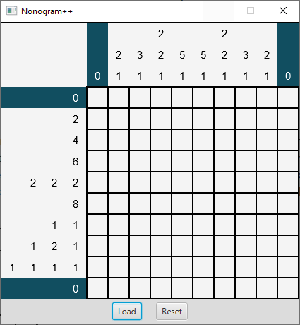
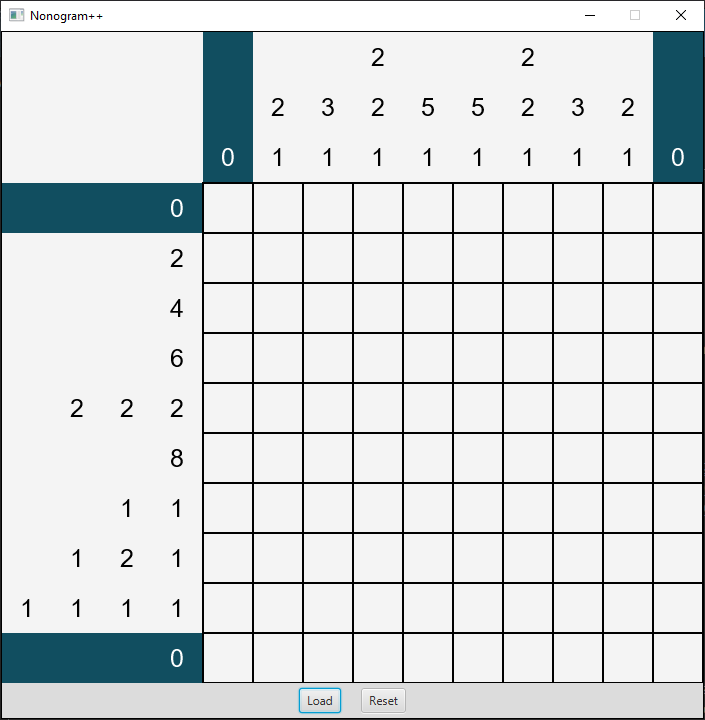
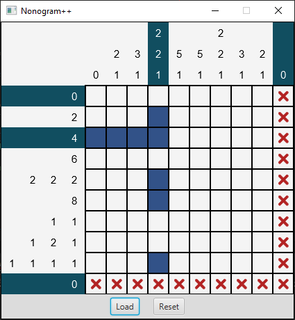
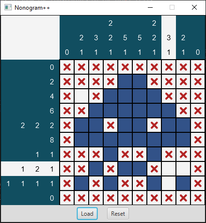
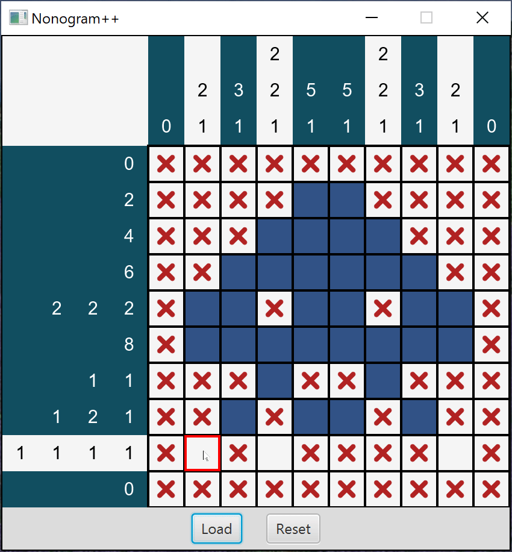
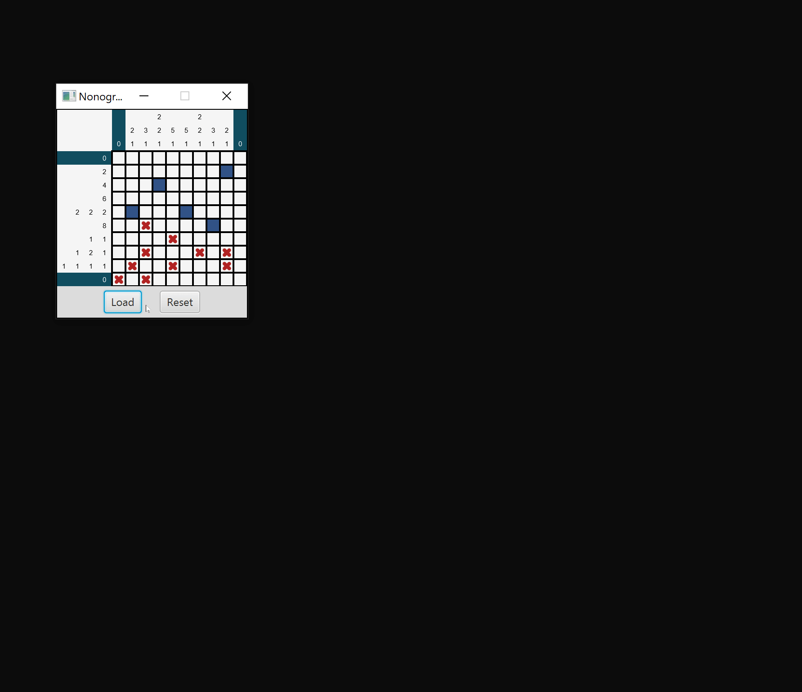

# Project 5: Not-From-Scratch Nonogram Player

> Programming isn't about what you know; it's about what you can figure out.
> 
> &mdash;Chris Pine, in *[Learn to Program](https://pine.fm/LearnToProgram/)*

In Project 4, we wrote a program that creates [nonograms](https://en.wikipedia.org/wiki/Nonogram) from [binary images](https://en.wikipedia.org/wiki/Binary_image).
For our final project, we will write a program that allows us to play those puzzles.

The program can run with zero or one command line argument. In both cases, a
default puzzle file is loaded. You will need to modify your
**Run Configuration** arguments to test out different cell sizes.

Running our program with no arguments opens the default puzzle with a cell
size of 30:

```console
java Main
```



Running our program with a single argument of 50 opens the default puzzle with a
cell size of 50:

```console
java Main 50
```



Furthermore, you can load in different puzzles by clicking the **Load** button.
You can load in puzzles using the format defined in Project 4.<sup id="a1">[1](#f1)</sup>
For testing, we have included a few minimal puzzle files that do not contain
grid values at the bottom of the file (i.e., they only include the row count,
column count, row projections, and column projections).

Note that the background color of the clues in the first and last rows and the
first and last columns is midnight green instead of white.
This indicates that the states of the cells in these rows and columns solve the
clue numbers. In this case, the numbers are 0, so they are trivially solved by
the initial (empty) states.

Left-clicking on an empty cell changes its state to filled, which is represented
by the color blue. Right-clicking changes the state to marked, which is
represented by a red X. Marked cells are treated as empty when the game checks
whether a row or column is solved, but the marks can be used by the player to
label cells that they know are empty.

The next image shows the puzzle after changing the states of 8 cells to filled.
The new states solve the clues in the third row and fourth column, so the
background color of these clues changed to green. The leftmost filled cell
contradicts the clue in the first column, so its background color changed to
white.

The cells in the bottom row and right column have all been marked. This does not affect 
the clues, but it helps to show the constraints on the other cells.
For instance, if we also mark the cells in the top row and left column, it
becomes clear that the cells in the sixth row must all be filled.



The next image shows the puzzle with all but two of the clues solved.
Filling the cell in the eighth row and the eighth column will solve the puzzle.
Note that some of the filled cells in the previous image were incorrect, even though the background color of the corresponding clues was green.
Individual row and column clues usually have multiple solutions, and the background color will turn green for all of them.
To solve the entire puzzle, however, the clues for all the rows and columns must be solved simultaneously.<sup id="a2">[2](#f2)</sup>



The final image shows the behavior of the program when the player solves the
puzzle. An [Alert](https://openjfx.io/javadoc/11/javafx.controls/javafx/scene/control/Alert.html)
is displayed to notify the player. All of the marked cells are changed to empty
cells, and the color of the white square in the top-left corner turns green.
Additionally, the player can no longer change the states of the cells.



### Load Button

As previously mentioned, the **Load** button is used to load in a puzzle file.
When a new puzzle is loaded, the grid is resized to accommodate the new puzzle's
width and height. Furthermore, any existing marks are removed.



### Reset Button

The **Reset** button is used to clear all cells by setting them to the empty
state. If the puzzle was solved, the **Reset** button allows the player to solve
the puzzle again. After resetting a solved puzzle, the player should be able to
change cell states again.


## Submission and Grading

Submission and grading requirements are given on Canvas.

## Program Design

For this project, you will be creating your own UML diagram. You can use
[UMLet](https://www.umlet.com/) to accomplish this task. Detailed requirements
for the UML diagram are given on Canvas.

You can [download UMLet stand-alone using this link](https://www.umlet.com/changes.htm).
**NOTE: Do not click the shady ad on the website.** Look for text that says

> New in UMLet 14.3 [stand-alone](https://www.umlet.com/download/umlet_14_3/umlet-standalone-14.3.0.zip) and [UMLet 14.3 Eclipse plugin (p2 repository)](https://www.umlet.com/download/umlet_14_3/umlet-eclipse-p2-14.3.0.zip)

and download the stand-alone edition. After downloading the UMLet zip file, you
can extract the files to a location on your machine. Windows devices can run 
Umlet.exe and umlet.jar. Macs can run umlet.jar. If you have any issues running
UMLet by double-clicking, try using the command line to navigate to the folder
with umlet.jar and run `java -jar umlet.jar`.

Below is an incomplete UML diagram:


You can [view a PDF version by using this link](img/uml.pdf).

### Main

The Main class has one instance method that sets the content of the Application window.
The start method constructs a NonogramPresenter instance and displays it.

* `start(Stage primaryStage)`: Perform these steps to display the options menu:

  1. Use the [`getParameters()`](https://openjfx.io/javadoc/11/javafx.graphics/javafx/application/Application.html#getParameters()) method to extract the cell size (if one is provided).
    1. Construct a NonogramMakerPresenter using the given cell size. If no arguments are provided, then you should use the DEFAULT_CELL_SIZE.
    1. Create a [Scene](https://openjfx.io/javadoc/11/javafx.graphics/javafx/scene/Scene.html) with the NonogramPresenter's pane and set it on the primary [Stage](https://openjfx.io/javadoc/11/javafx.graphics/javafx/stage/Stage.html).
    1. Add the style sheet `style.css` to the scene.
    1. Add the application name to the title bar, prevent the window from resizing, and then show the window.

### CellState

This [enum](https://docs.oracle.com/javase/tutorial/java/javaOO/enum.html) is
used to represent the state of the NonogramModel grid.

* There are three states: `EMPTY, FILLED, MARKED`
    * EMPTY represents an empty cell (shown in a white box in the earlier images)
    * FILLED represents a filled cell (shown in a blue box in the earlier images)
    * MARKED represents an X'd out cell (shown using a red X in the earlier images)
* Also, define a public static helper method called `toBoolean(CellState state)`
   * Return true if the state is filled. Otherwise, return true.
   * This can be accomplished in a one-liner.
   * This method is not tested directly in our tests, but you may find it useful
     in the NonogramModel class.

### NonogramModel

This class encapsulates the state and rules of the game.
It stores arrays with the row clues, column clues, and cell states (EMPTY, FILLED, or MARKED).

* `NonogramModel(int[][] rowClues, int[][] colClues)`: Initialize the object using the given arrays of row and column clues.
Make deep copies of the arrays to protect the data.
Create a cell grid with the same number of rows and columns, and initialize the states to EMPTY. This constructor is implemented for you, but you will need to finish the implementation of the `deepCopy()` method for it to pass the tests.

  In general, a clues array (`rowClues` or `colClues`) will look like the following:
  
  ```
  {
    {0},
    {2},
    {4},
    {6},
    {2, 2, 2},
    {8},
    {1, 1},
    {1, 2, 1},
    {1, 1, 1, 1},
    {0}
  }
  ```
  
  The array given above corresponds to the row projections of the
  [space invader puzzle file](puzzles/space-invader.txt).

* `NonogramModel(File file)`: Initialize the object using the row and column clues in the given file.
Set all of the cell states to EMPTY. This constructor is mostly implemented for you.

* `NonogramModel(String filename)`: Initialize the object using the row and column clues in the text file with the given name.
You can call one of the other constructors in **this** class. This constructor is incorrectly implemented for you.

* `int getNumRows()`: Return the number of rows in the nonogram.

* `int getNumCols()`: Return the number of columns in the nonogram.

* `getCellState(int rowIdx, int colIdx)`: Return the state of the cell with the given row and column indices.

* `getCellStateAsBoolean(int rowIdx, int colIdx)`: Return the boolean state of the cell with the given row and column indices. A FILLED cell returns true. Otherwise, return false. You can use the `toBoolean(CellState state)` method to convert a CellState to a boolean value directly.

* `setCellState(int rowIdx, int colIdx, CellState state)`: Set the state of the cell with the given indices.
If the enum value is null or the puzzle is solved, do nothing.
Return a boolean value that indices whether the state of the puzzle changed.

* `getRowClues()`: Return a deep copy of the row clues.

* `getColClues()`: Return a deep copy of the column clues.

* `getRowClue(int rowIdx)`: Return a copy of the row clue with the given index.

* `getColClue(int colIdx)`: Return a copy of the column clue with the given index.

* `isRowSolved(int rowIdx)`: Return true if the row with the given index is solved.
A row is solved if the projected cellStates row matches the row's clue.
Otherwise, return false.

* `isColSolved(int colIdx)`: Return true if the column with the given index is solved.
A column is solved if the projected cellStates column matches the column's clue.
Otherwise, return false.

* `isSolved()`: Return true if the puzzle is solved; otherwise, return false.

* `resetCells()`: Change the state of all cells to EMPTY.

* `project()`: As in Project 4, return the nonogram numbers of the given array of cell states. This method can be transferred from Project 4, provided that you had a working implementation.

* `projectCellStatesRow(int rowIdx)`: Return the projection of the cellStates row with the given index. This will be similar to `projectRow()` from Project 4, but you will need to convert cell states into boolean values first. Furthermore, you will need to convert the List<Integer> result to an int[].

* `projectCellStatesCol(int colIdx)`: Return the projection of the cellStates column with the given index. This will be similar to `projectCol()` from Project 4, but you will need to convert cell states into boolean values first. Furthermore, you will need to convert the List<Integer> result to an int[].

* `initCellStates(int numRows, int numCols)`: A private static helper method that returns a 2D array of empty cell states. This method is implemented for you.

* `deepCopy(int[][] array)`: A private static helper method that returns a deep copy of a 2D array.
You will need to implement this method.

* `readClueLines(BufferedReader reader, int numLines)`: A private static helper method that uses a BufferedReader to read in a specified number of lines from a file, parses out each line into a set of clues, and returns an array of these clues. This method is implemented for you.

### Handlers and Interfaces

You can transfer handlers and interfaces from Project 4 into Project 5.
You do not need any of the save-related handlers/interfaces. Therefore, you can
transfer the following:

* AbstractBaseHandler.java
* OpenHandler.java
* Openable.java

### NonogramPresenter

As in Project 4, the NonogramPresenter class represents the brain of our
program. The graphical view and model data are connected and synchronized
by the presenter.

Because the size of a NonogramModel is immutable, any size adjustments (rows or
columns) require re-initializing the model and view information. The model
reference is completely updated. The view reference stays the same, though
underlying data within the view may change.

* `NonogramPresenter(int cellLength)`: Construct and initialize the presenter.
    * Construct a new NonogramModel instance using the DEFAULT_PUZZLE and assign it to the instance variable.
    * Construct a new View instance and assign it to the instance variable.
    * Make sure the presenter is initialized (see `initPresenter()`).

* `initializePresenter()`: Use helper methods to initialize the presenter.
    * Make sure the view is initialized.
    * Make sure cell views are binded.
    * Make sure the model and view data are synchronized.
    * Make sure buttons are configured.

* `initializeView()`: Initialize the view (to show the clues/cells). This method
is similar to the `initToggleButtons()` method from Project 4.
    * Initialize the view using the NonogramView's public `initialize(int[][] rowClues, int[][] colClues, int cellLength)` method.
    * If the window is not null, execute getWindow().sizeToScene() to make sure the window is not too big/too small.

* `bindCellViews()`: For each cell, add an EventHandler<MouseEvent> to handle mouse
clicks.
    * For each cell at position row, column, get the associated CellView.
    * Use each CellView's `setOnMouseClicked(EventHandler<? super MouseEvent> arg)` method to
      do the following:
        * Get the [MouseButton](https://openjfx.io/javadoc/11/javafx.graphics/javafx/scene/input/MouseButton.html)
          that triggered the event.
            * Call the `handleLeftClick()` method when the left button is clicked.
            * Call the `handleRightClick()` method when the right button is clicked.

* `handleLeftClick(int rowIdx, int colIdx)`: Update the cell state at this grid position.
    * Determine the new state of the cell based on the model's current cell state:
        * Left-clicking changes an EMPTY or MARKED cell to FILLED.
        * Left-clicking a FILLED cell changes it to EMPTY.
    * Use the `updateCellState()` method to update the model and view appropriately.

* `handleRightClick(int rowIdx, int colIdx)`
    * Determine the new state of the cell based on the model's current cell state:
        * Right-clicking changes an EMPTY or FILLED cell to MARKED. 
        * Right-clicking a MARKED cell changes it to EMPTY.
    * Use the `updateCellState()` method to update the model and view appropriately.

* `updateCellState(int rowIdx, int colIdx, CellState state)`:
    * Update the model (but don't update the view if nothing changed).
    * Update the view.
        * Use the view's setCellState, setRowClueState, and setColClueState methods.
        * If the model is solved, process the player's victory.

* `synchronize()`: Synchronize the state of the model and the view.
    * Synchronize the cell views with the cell states. (Hint: use `model.getCellState` and `view.setCellState`)
    * Synchronize the clue views with the row and column states. (Hint: use `view.setRowClueState` and `view.setColClueState`)
    * Synchronize the puzzle state (puzzle state refers to if the puzzle is solved/not solved).
    * If the puzzle is solved, invoke the `processVictory()` method.
    
* `processVictory()`: Handle player victory.
    * Remove marks from the cell view.
    * Use the view to show a victory alert.

* `removeCellViewMarks()`: Remove all marks (red X's) from the view.
    * You need to determine which cells from the model correspond to marked cells.
    * To remove a mark from the view, call `view.setCellState(rowIdx, colIdx, CellState.EMPTY)`.

* `configureButtons()`: Set the actions for the load and reset buttons.
    * For the load button, pass in an OpenHandler instance in a similar manner to Project 4.
    * For the reset button, add an ActionEvent EventHandler that calls the `resetPuzzle()` method.

* `resetPuzzle()`: Clear the model using the reset method and synchronize the model/view.

* `getPane()`: One-liner to get the pane associated with this presenter.

* `getWindow()`: Method similar to Project 4's getWindow method. Note that the NonogramView
  is now a Pane, so there is no view.getPane().

* `open(File file)`: Re-initialize the model variable by calling the appropriate NonogramModel constructor. Then, initialize the presenter.

## Graphical Interface

Several classes for the GUI are provided for you. Some implementations are
complete and others are almost complete.

Unlike in Project 4, where each GUI class *encapsulated* a subclass of [Pane](https://openjfx.io/javadoc/11/javafx.graphics/javafx/scene/layout/Pane.html), the GUI classes in this project each *extend* a subclass of Pane.
This makes it more convenient to combine graphical components in different objects because the objects themselves can be added to scenes and panes, rather than having to call methods to access the components (e.g., the getPane method in Project 4).

### NonogramView

This class is a [BorderPane](https://openjfx.io/javadoc/11/javafx.graphics/javafx/scene/layout/BorderPane.html) that displays the row clues in the left position, the column clues in the top position, and the cells in the middle position.

* `NonogramView()`: Construct a NonogramView instance by add the style class 
  "nonogram-view" (given as a constant).

* `initialize(int[][] rowClues, int[][] colClues, int cellLength)`: Initialize the view.
    * Construct and set the leftCluesView, topCluesView, and cellGridView instance variables
      using the given parameters. Hint: create a helper method to calculate the maximum length
      of a clue to for the LeftCluesView width/TopCluesView height.
    * Then, use setLeft, setTop, and setCenter to set the appropriate parts of the BorderPane.
    * Also, initialize HBox with the **Load** and **Reset** buttons. Use setBottom to add the
      HBox to this BorderPane.
    
  For example, say we had the following array of rowClues.
  ```java
  int[][] rowClues = {
    {0},
    {2},
    {4},
    {6},
    {2, 2, 2},
    {8},
    {1, 1},
    {1, 2, 1},
    {1, 1, 1, 1},
    {0}
  };
  int rowCluesWidth = ...; // You may define a helper method to figure this out.
                           // In this case, the value is 4 since the longest
                           // clue {1, 1, 1, 1} has 4 elements.
  ```
  
  To construct the leftCluesView, we would do
  ```java
  leftCluesView = new LeftCluesView(rowClues, cellLength, rowCluesWidth);
  ```
* `initBottomHBox()`: Initialize the bottomHBox variable.
  * Create a new HBox instance and set the appropriate instance variable
  * Set the HBox's alignment to Pos.CENTER
  * Create a **Load** and a **Reset** button
  * Add the buttons to the HBox

* `getCellView(int rowIdx, int colIdx)`: Call getCellView on the CellGridView to get the CellView with the given indices.

* `setCellState(int rowIdx, int colIdx, CellState state)`: Call setCellState on the CellGridView to update the state of the CellView with the given indices.

* `setRowClueState(int rowIdx, boolean solved)`: Call setRowState on the RowCluesView to update the state of the RowClueView with the given index.

* `setColClueState(int colIdx, boolean solved)`: Call setColState on the ColCluesView to update the state of the ColClueView with the given index.

* `setPuzzleState(boolean solved)`: If the puzzle is solved, add the style class "nonogram-view-solved".
Otherwise, remove all occurrences of this style class.

* `getLoadButton()`: Return the load button.

* `getResetButton()`: Return the reset button.

* `showVictoryAlert()`: Show a victory alert as shown in an earlier image.
  Try reading up on the JavaFX Alert class online to figure out what methods can
  be used to achieve the Alert (with the text "Puzzle Solved", "Congratulations!",
  and "You Win!").
  
### CellGridView

This class is a [GridPane](https://openjfx.io/javadoc/11/javafx.graphics/javafx/scene/layout/GridPane.html) that displays the cell states.

* `CellGridView(int numRows, int numCols, int cellLength)`: Create a two-dimensional array of CellViews and add them to the GridPane at the positions with the same row and column indices. Also, add the style class given as a constant.

* `initCells(int numRows, int numCols, int cellLength)`: Initialize the cells of this view.
    * Clear the children of this view.
    * Initialize the cellViews array using the given dimensions.
    * Suggestion: take a look at the [addRow](https://openjfx.io/javadoc/11/javafx.graphics/javafx/scene/layout/GridPane.html#addRow(int,javafx.scene.Node...)) method of the GridPane class. You may find it easier
      to work with. This is just a suggestion though, as you can do something similar to your
      Project 4 code instead to accomplish the same result.

* `getCellView(int rowIdx, int colIdx)`: Get the CellView using the given indices.

* `setCellState(int rowIdx, int colIdx, CellState state)`: Update the state of the CellView with the given indices.

### Remaining View Classes

* The CellView class is provided for you. It represents a single nonogram cell
  that can be shown as empty, filled, or marked. This class is implemented for
  you.
* ClueItemView represents a single clue. It may have a numerical value or a
  blank String. This class is implemented for you.
* AbstractOrientedClueView, HorizontalClueView, and VerticalClueView represent
  the numbered clues for a single row or column. The abstract class extends
  FlowPane, and the subclasses set the appropriate orientation. These classes
  are complete.
* AbstractGroupCluesView, LeftCluesView, and TopCluesView represent a group of
  row clues or column clues. The abstract class extends FlowPane, and the
  subclasses set the appropriate orientation. These classes are not fully
  complete:
    * LeftCluesView needs an implementation for the makeClue method. It should return a child
      instance of AbstractOrientedClueView (i.e., either HorizontalClueView or VerticalClueView).
    * TopCluesView also needs an implementation for the makeClue method.
    * There is a bug with these classes that becomes apparent if you try and load in a "large
      puzzle" (bigger than 10 x 10 at least). The clues appear to "wrap around" if there are
      more than a certain number of them. Determine the cause of the issue and update your
      code to fix it. Try loading in [puzzles/ou-logo.txt](puzzles/ou-logo.txt) and make sure
      there are no issues.

## Footnotes

<a id="f1">[1.](#a1)</a> The first line contains the dimensions of the cell grid: the number of rows *R* followed by the number of columns *C*.
The next *R* lines contain the nonogram numbers for the rows in order from top to bottom with one row per line.
Similarly, the final *C* lines contain the nonogram numbers for the columns in order from left to right with one column per line.
The remaining lines represent the rows and columns of the cell grid where 0s represent empty cells and 1s represent filled cells.

<a id="f2">[2.](#a2)</a> Not all nonograms have unique solutions.
For instance, if a checkerboard pattern with an even number of rows or columns solves a puzzle, it will solve the same puzzle if the empty and filled cells are flipped.
Our program will accept either solution.
